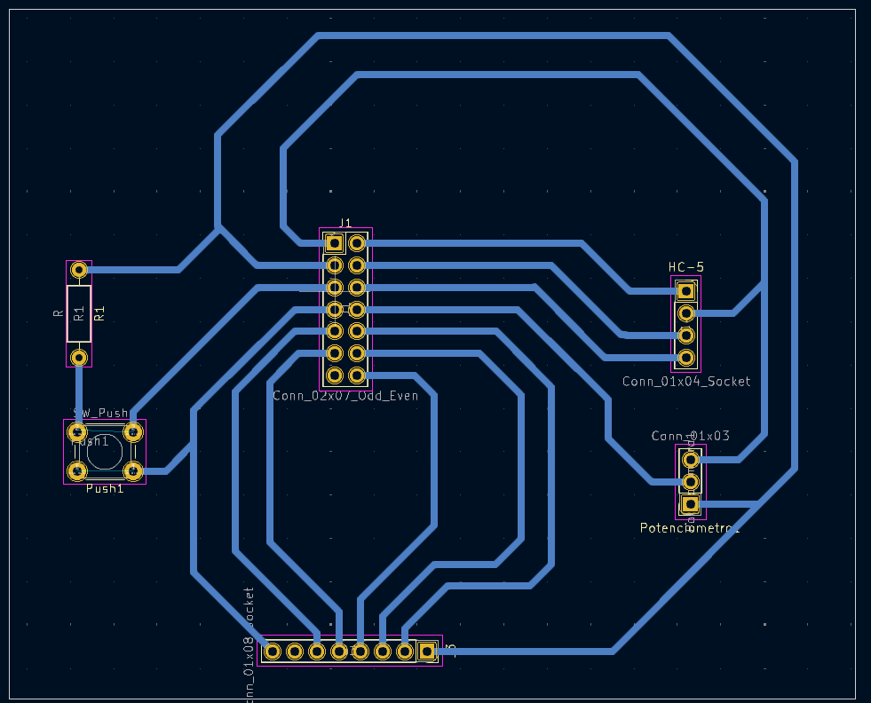

# A Nova Arte Moderna 3.0 

O projeto 3 consiste em uma nova versão dos anteriores em que após integrar a cooperação entre dois usuários pela comunicação UART, iremos criar um módulo em placa impressa para agregar de forma otimizada os seguintes features:

- Comunicação Bluetooth usando uma das UART disponíveis;
- Controle da intensidade por um potenciômetro em uma entrada ADC do Raspberry pi;
- Um botão para acionar o envio de mensagens e sincronização do canvas;
- Oled colorido de 1,8'' para melhorar a experiência visual do macro;

Além disso para dar suporte ao Oled será utilizado um mini-cavalete confeccionado em uma impressora 3D.

# Cavalete 3D

O cavalete foi obtido através do link:

# Layout da Placa
Com as conexões necessárias identificadas, projetou-se, através do software KiCAD, a placa:

# Resultados e Conclusão 

Como parte do projeto tivemos um erro de design na placa em que o potenciômetro não foi conectado a uma entrada ADC, impossibilitando sua leitura. No geral a limitação de usar as apenas as entradas disponíveis no conector IDC da Bitdoglab, gerou complexidade e inflexibilidade nas possibilidades de design. Em relação a UART que estava disponivel nos GPIO 8 e 9, ela não funcionou como esperado sem conclusão sobre seu mal funcionamento. Para o correto funcionamento desse projeto é necessário reajustar esses pontos de design como um todo da placa impressa e suas conexões com a Bitdoglab. 

